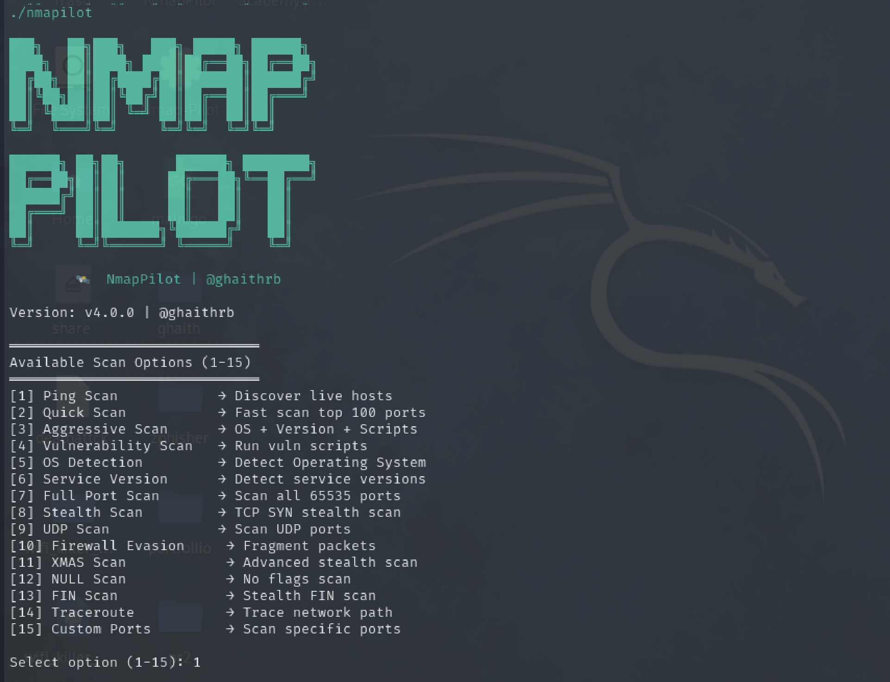

# 🚀 NmapPilot

<p align="center">
  <b>Cross-Platform Network Scanning & Reconnaissance Tool</b><br>
  Designed for Students, Cybersecurity Enthusiasts & Lab Environments
</p>

---

## 📌 Overview

**NmapPilot** is a lightweight, cross-platform network scanning tool inspired by Nmap.
It simplifies network reconnaissance by providing a clean terminal-style interface while remaining powerful enough for educational penetration testing labs.

The tool is available for:

* 🐧 Linux
* 🪟 Windows
* 🍎 macOS

It supports IP scanning, subnet scanning, service discovery, and result exporting.

---

## 🖼 Tool Preview

<p align="center">
  
</p>

---

# ✨ Features

* ✔ Fast TCP port scanning
* ✔ Host discovery
* ✔ Service detection
* ✔ Subnet scanning (CIDR support)
* ✔ Export scan results
* ✔ Clean hacker-style terminal output
* ✔ Precompiled binaries for Linux, Windows, and macOS
* ✔ Easy-to-use command interface

---

# 🧠 How It Works

NmapPilot performs reconnaissance by:

1. Sending TCP connection attempts to target ports.
2. Identifying open, closed, or filtered ports.
3. Attempting basic service detection.
4. Displaying formatted results.
5. Optionally saving the results to a file.

For advanced scanning (privileged scans), administrator/root permissions may be required.

---

# 💻 Supported Platforms & Execution Guide

| Operating System | File to Use        | How to Run                 | Requires Admin?   |
| ---------------- | ------------------ | -------------------------- | ----------------- |
| 🐧 Linux         | `nmapilot`         | `./nmapilot`               | Yes (recommended) |
| 🪟 Windows       | `nmapilot.exe`     | Double-click or run in CMD | Yes (recommended) |
| 🍎 macOS         | `nmapilot_for_MAC` | `chmod +x` then execute    | Yes (recommended) |

---

# 🐧 Linux Installation & Usage

### Step 1: Navigate to Project Folder

```bash
cd NmapPilot
```

### Step 2: Give Execution Permission

```bash
chmod +x nmapilot
```

### Step 3: Run the Tool

```bash
./nmapilot
```

### For Full Port Scan (Recommended)

```bash
sudo ./nmapilot
```

### Example Commands

```bash
./nmapilot 192.168.1.10
./nmapilot 192.168.1.0/24
./nmapilot 192.168.1.10 -o results.txt
```

---

# 🪟 Windows Installation & Usage

### Step 1:

Download or locate `nmapilot.exe`

### Step 2:

Open Command Prompt inside the project folder.

### Step 3:

Run:

```cmd
nmapilot.exe 192.168.1.10
```

Or simply double-click `nmapilot.exe`.

### Run as Administrator (Important)

Right-click → **Run as Administrator**
This allows deeper scanning capabilities.

---

# 🍎 macOS Installation & Usage

### Step 1:

Open Terminal and navigate to project directory.

```bash
cd NmapPilot
```

### Step 2:

Make executable:

```bash
chmod +x nmapilot_for_MAC
```

### Step 3:

Run the tool:

```bash
./nmapilot_for_MAC 192.168.1.10
```

### For Best Results:

```bash
sudo ./nmapilot_for_MAC
```

---

# 📦 Project Structure

```
NmapPilot/
│
├── img/                     # Screenshots and assets
├── nmapilot                 # Linux executable
├── nmapilot.exe             # Windows executable
├── nmapilot_for_MAC         # macOS executable
└── .git
```

---

# 🔧 Technologies Used

* Python 3
* Socket Programming
* System Networking APIs
* PyInstaller (for executable builds)
* Custom ASCII Interface

---

# ⚠ Legal Disclaimer

This tool is intended for:

* Educational purposes
* Lab simulations
* Authorized penetration testing

Do NOT scan networks without proper authorization.
The developer is not responsible for misuse of this tool.

---

# 👨‍💻 Author

**Ghaith Riabi**
Cybersecurity Student | Network Engineer
Passionate about Ethical Hacking & SOC Implementation

---

# 📄 License

MIT License
You are free to modify and distribute this project for educational purposes.

---

# ⭐ Support

If you like this project:

* Give it a ⭐ on GitHub
* Share it with your cybersecurity community
* Contribute improvements

<p align="center">
  <b>Built with passion for cybersecurity 🔥</b>
</p>
